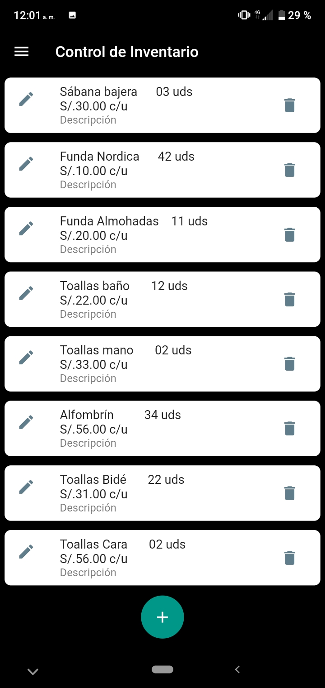

# inventory

Una apliación en Flutter

## Requerimientos

-flutter 1.22.2
-dart 2.10.2
-SDK de android

## Entorno de Desarrollo

-Visual Estudio Code 1.52.1
-Emulador Genymotion
-git version 2.27.0.windows.1

## Depemdencias en Flutter
```
dependencies:
  flutter:
    sdk: flutter
  flutter_localizations:
    sdk: flutter
  intl: ^0.16.1
  charts_flutter: ^0.8.0
  syncfusion_flutter_charts: ^18.3.53
  fl_chart: ^0.12.1

```
## Muestra de Interface





